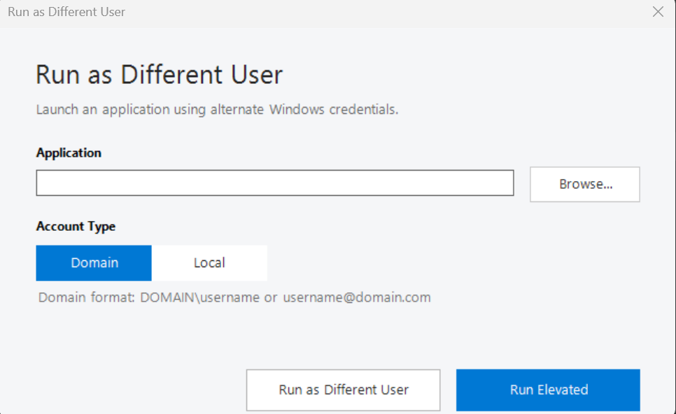

# RunAsLauncher

A lightweight PowerShell GUI for launching Windows applications
using alternate credentials or UAC elevation.

## Screenshot

## Features

- Run applications using alternate credentials
- Domain and local account selection
- UAC elevation
- EXE and MSC support
- Microsoft Management Console support
- Windows Forms GUI
- Credentials are not stored

## Requirements

- Windows 10 or Windows 11
- Windows PowerShell 5.1

## Usage

1. Download `RunAsLauncher.ps1`.
2. Launch the script using Windows PowerShell 5.1.
3. Select an EXE or MSC application.
4. Select Domain or Local when using alternate credentials.
5. Choose **Run as Different User** or **Run Elevated**.

### Domain Accounts

Use:

    DOMAIN\username

### Local Accounts

Use:

    .\username

## Security

RunAsLauncher does not store credentials.

**Run as Different User** uses PowerShell's `Get-Credential`
and `Start-Process -Credential`.

**Run Elevated** uses the standard Windows UAC mechanism through
`Start-Process -Verb RunAs`.

The Domain/Local selector applies only to **Run as Different User**.

## License

MIT
